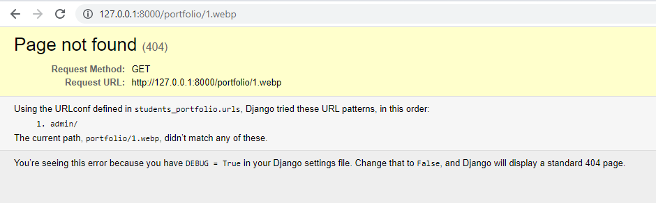
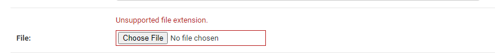
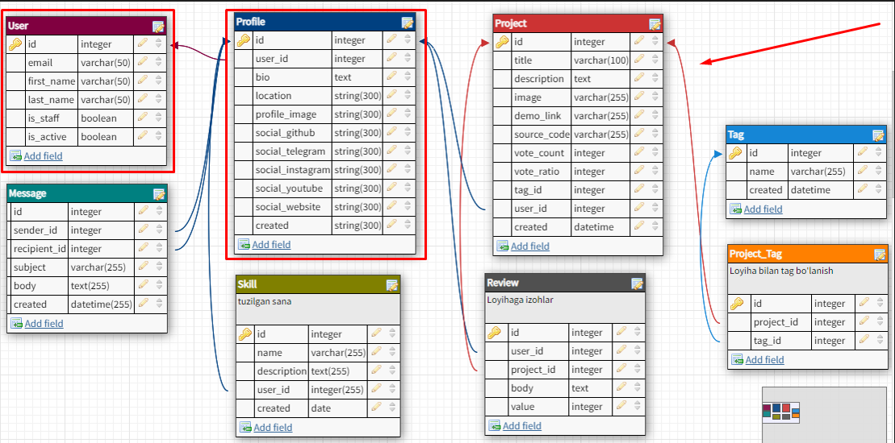
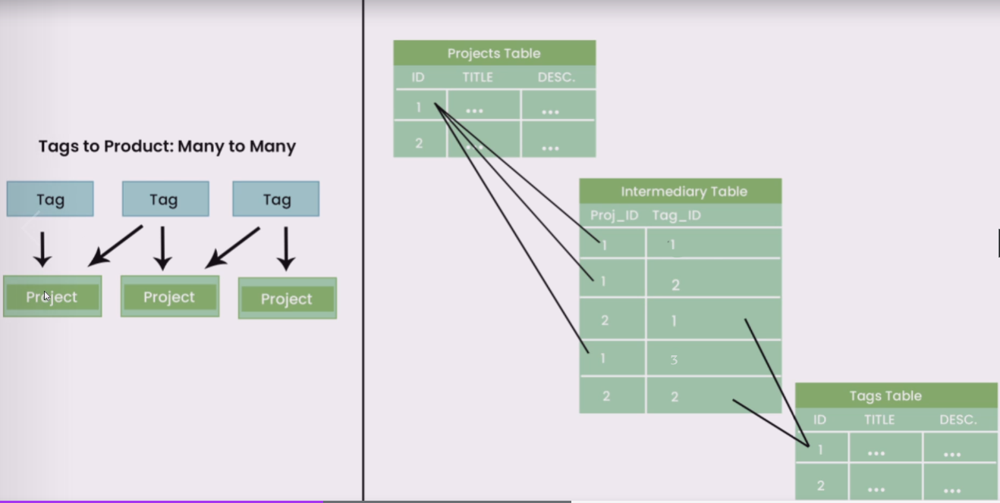

# Mavzu 2: Modellar bilan ishlash
 
## Reja:
1. [Bilim](#1-bilim)
   - [1.1 Terminlar](#11-terminlar)
   - [1.2 O'qish uchun materiallar](#12-oqish-uchun-materiallar)
2. [Amaliyot. O'qituvchi](#2-amaliyot-oqituvchi)
3. [Amaliyot. O'quvchi](#3-amaliyot-oquvchi)

## 1. Bilim

### 1.1 Terminlar
```
```
### 1.2 O'qish uchun materiallar
https://docs.djangoproject.com/en/4.0/topics/db/models/
https://docs.djangoproject.com/en/4.0/topics/files/

## 2. Amaliyot. O'qituvchi

**Reja:**
- [2.1 CREATE - tuzish](#21-CREATE---tuzish)
  - [2.1.1 Profile modeli](#211-profile-modeli)
  - [2.1.2 Project modeli](#212-project-modeli)
  - [2.1.3 Message modeli](#213-message-modeli)
  - [2.1.4 Skill modeli](#214-skill-modeli)
  - [2.1.5 Review modeli](#215-review-modeli)
  - [2.1.6 Tag modeli](#216-tag-modeli)
  - [2.1.7 Signallar](#217-signallar)
  - [2.1.8 Property](#218-property)  
- [2.2 Modellarni bog'lash](#22-modellarni-boglash)
   - [2.2.1 Birga bir](#221-birga-bir)
   - [2.2.2 Birga ko'p](#222-birga-kop)
   - [2.2.3 Ko'pga ko'p](#223-kopga-kop)

### 2.1 CREATE - tuzish
CREATE bu SQL so'rov tilida jadval tuzish uchun ishlatiladi. Djangoda esa bu modellar orqali amalga oshiriladi. Jadval tuzish uchun qadamlar:

1. **Ma'lumotlar ba'zasi strukturasi**ni(sxemasi) ishlab chiqish
2. Ma'lumotlar strukturasiga qarab **model** yozish
3. Makemigration - SQL so'rovga o'xshash buyruqlarni hosil qiladi
4. Migrate - uni ma'lumotlar ba'zasiga tadbiq qilish (M: jadval tuzish, CRUD amallarini bajarish)

O'quvchilar portfoliosi modelini tuzamiz

Saytda qanday imkoniyatlar bo'lishi kerak:
- O'quvchilar haqida ma'lumot olish
- O'quvchilar loyihasini, kodini ko'rish
- O'quvchiga habar jo'natish
- O'quvchilar ishiga izoh yozish va baho qo'yish
- Loyihalarni teg bo'yicha qidirish
- O'quvchilarning qo'shimcha malakalari haqida ma'lumot olish
- Har bir o'quvchini alohida o'zini sahifasi bo'lsin
<br>
Ko'rinishi (zip fayl): https://github.com/Oybeklinux/django-beginner/tree/master/resurslar
<br>
Yuqoridagi imkoniyatlarni hisobga olib, quyidagicha MB sxemasi hosil bo'ladi
<br>


MB sxemasini ixtiyoriy online instrumentlardan biri yordamida yasaymiz:
- https://www.dbdesigner.net/
- https://sqldbm.com/Home/
- https://dbdiagram.io/home

MB sxemasini qilib bo'lgach, yangi loyiha ochib, app qo'shib modellarni yozishni boshlaymiz
<br>
1. Yangi loyiha ochish
```commandline
django-admin startproject students_portfolio
cd students_portfolio
python manage.py startapp users
python manage.py startapp projects
```


2. users va projects ni ro'yxatdan o'tkazamiz
<br>Buning uchun students_portfolio papkasida settings.py fayliga INSTALLED_APPS ga ikkalasini qo'shib qo'yamiz
```python
INSTALLED_APPS = [
    'django.contrib.admin',
    'django.contrib.auth',
    'django.contrib.contenttypes',
    'django.contrib.sessions',
    'django.contrib.messages',
    'django.contrib.staticfiles',
    'projects.apps.ProjectsConfig',
    'users.apps.UsersConfig'
]
```

3. Loyihani ishga tushiramiz
```commandline
python manage.py runserver
```
Xatolik bo'lmasa davom etamiz

4. Djangoda o'zini foydalanuvchiga bog'liq modellarini ishga tushiramiz. 

```commandline
python manage.py migrate
```

5. admin foydalanuvchi qo'shamiz

```commandline
python manage.py createsuperuser
```

6. loyihani ishga tushirib, http://127.0.0.1:8000/admin/ urlga parol login bilan kiramiz. Natijada biz users va groups jadvalini ko'ramiz

#### 2.1.1 Profile modeli

7. users/model.py ga kirib, profile modelini yozamiz

```python
from django.db import models


# Create your models here.
class Profile(models.Model):
    bio = models.TextField(blank=False, null=True)
    location = models.CharField(max_length=100)
    profile_image = models.ImageField(upload_to='portfolio', blank=True, default='empty.png')
    social_github = models.CharField(max_length=100)
    social_telegram = models.CharField(max_length=100)
    social_instagram = models.CharField(max_length=100)
    social_youtube = models.CharField(max_length=100)
    social_website = models.CharField(max_length=100)
    created = models.DateField(auto_now=True)
```

Bu yerda:
- Profile foydalanuvchi haqidagi jadvalni modeli/class.
- CharField - uzunligi cheklangan matn uchun
- TextField - uzunligi cheklanmagan matn uchun 
- DateField - Sana uchun
- ImageField - rasm uchun

Parametrlar:

- auto_now_add - sanali toifa uchun ishlatiladi. Yozuv kiritilgan vaqtni belgilaydi
- auto_now - sanali toifa uchun ishlatiladi. Yozuv o'zgargan vaqtni belgilaydi.
- blank - hamma toifa uchun ishlatiladi. Maydonni to'ldirish majburiy yoki majburiy emasligini tekshiradi. Agar True bo'lsa, to'ldirish majburiy emas, aks holda majburiy bo'ladi
- null - hamma toifa uchun ishlatiladi. MBda ushbu maydon Null bo'lishligiga tekshiradi. Agar True bo'lsa Null bo'lishi mumkin
- max_length - uzunligini bildiradi. CharField toifasida bu parametrni yozish majburiy


8. Modelni jadvalga aylantiramiz
```commandline
python manage.py makemigrations
python manage.py migrate
```

Bu yerda: <br>
- makemigrations - Modelni o'qib ilovada migrations katalogida har bir buyruq uhcun alohida faylda (kemta-ket) kod generatsiya qiladi. Keyinchalik uni ishga tushirish uchun
- migrate - makemigrations dan hosil bo'lgan kodni ishga tushirib, MBga ta'sir o'tkazadi, ya'ni o'zgartiradi

9. Loyihani ishga tushirib, admin panel dan ko'ring. Jadval ko'rinmaydi. Ko'rinishi uchun admin.py fayliga quyidagini yozamiz

```python
from django.contrib import admin
from .models import Profile

# Admin panelda Profile ni ko'rish uchun 
admin.site.register(Profile)
```

Admin paneldan Profile ga ma'lumot qo'shamiz. So'ng rasm qayerga yuklanganligiga ahamiyat bering, u loyiha katalogida portfolio katalogini hosil qilib, hamma rasmlarni usha yerga yuklaydi. Agar bu yo'lni o'zgartirmochi bo'lsak, unda keyingi qadamni amalga oshiring

10. Rasm, video, fayllarni yuklash yo'lini o'zgartiring. Buning uchun settings.py faylida MEDIA_ROOT o'zgaruvchisiga sizga kerakli yo'lni ko'rsating
<br>
    
Har hil qiymat berib ko'ring:
- MEDIA_ROOT = "". Buni yozmasangiz ham shunday bo'ladi, ya'ni default shunday. Bu holda to'g'ridan to'g'ri ilova katalogini ko'rsatgan bo'lasiz    
- MEDIA_ROOT = '/media/'. Bu holda C:/media/ ni ko'rsatgan bo'lasiz
- MEDIA_ROOT = os.path.join(BASE_DIR, 'media'). BASE_DIR - ilova katalogi yo'li. os.path.join yo'l yasab beradigan funksiya. Shunday qilib ilovasa media katalogini hosil qilib, yuklanadigan fayllar usha yerga tushadi 

11. Ma'lumotlarni qaysi birini to'ldirish shart yoki shart emasligini modelning tegishli hususiyatiga blank=True/False qiymatlarini berib, ishlatib tushunib oling. Djando admin panelda majburiy bo'lsa nomi qalin qilib yozilgan bo'ladi. 

12. Admin panelda maydonlar avtomat biron qiymatni olishi uchun modelning tegishli hususiyatiga default=qiymat bering.
<br>
Kiritilgan ma'lumotlarni ko'ra olasiz, faqat fayllarni hususan rasmni ko'rmoqchi bo'lsangiz quyidagicha habar chiqadi



13. Rasmni url orqali ochish uchun settings.py ga MEDIA_URL = "" o'zgaruvchisini yozamiz 

```python
MEDIA_URL = ""
```

So'ng bu yo'lni urls.py ga ko'rsatib qo'yishimiz kerak, aks holda ochmaydi
```python
from django.contrib import admin
from django.urls import path
from django.conf.urls.static import static
from django.conf import settings


urlpatterns = [
    path('admin/', admin.site.urls),
]
# rasm, fayl, videolarni url orqali ochish uchun
urlpatterns += static(settings.MEDIA_URL, document_root=settings.MEDIA_ROOT)
```

Ishga tushirib rasmlarni ochib ko'ring. MEDIA_URL ni o'zgartirib ko'ring, yana ishga tushirib, rasmlarni oching ba urlga ahamiyat bering. Nima o'zgardi?

14. Ushbu Profile modeliga video(eng yaxshi ko'rgan kino), audio (eng yaxshi ko'rgan musiqasi), file(rezyumesi) ni quyidagicha qo'shing:

```python

file = models.FileField(upload_to='files')
video = models.FileField(upload_to='videos')
audio = models.FileField(upload_to='audios')
```

So'ng uni tadbiq qiling:
```commandline
python manage.py makemigrations
python manage.py migrate 
```
Sizda quyidagicha xatolik beradi:


Sababi sizda ma'lumot kiritilgan, siz portfolio jadvaliga yangi ustun qo'shmoqchisiz, lekin kiritilib bo'lingan foydalnuvchilarning video, audio va file qiymati nima bo'ladi? Buni biz modelda belgilamasak, unda bu majburiy bo'ladi va ularga oldindan qiymat berishimiz kerak bo'ladi. Uning ikkita yo'lini ko'ramiz
<br><br>
**1-holat**. Har biriga null=True beramiz, ya'ni ular MBda null bo'lishi mumkin degani
```python
file = models.FileField(upload_to='files', null=True)
video = models.FileField(upload_to='videos', null=True)
audio = models.FileField(upload_to='audios', null=True)
```

Ikkinchi holatni ko'rishdan avval oldingi holatni bekor qilamiz. Uning uchun file, video, audio qatorlarini comment qilib, makemigrations, mirate buyruqlarini amalga oshiramiz:

```python
file = models.FileField(upload_to='files')
video = models.FileField(upload_to='videos')
audio = models.FileField(upload_to='audios')
```
```commandline
python manage.py makemigrations
python manage.py migrate 
```  
<br>**2-holat**. Har biriga default=qiymat beramiz
<br>Hozirgi holatda har biriga default=faly ni ko'rsatish, mantiqan xato, lekin kodni tuhsunish uchun qilib ko'ramiz. Mantiqan buni rasm uchun qilish to'g'ri bo'ladi.


```python
file = models.FileField(upload_to='files', default='files/default.docx')
video = models.FileField(upload_to='videos', default='videos/default.avi')
audio = models.FileField(upload_to='audios', default='audios/default.mp3')
```  
Bu 3 fayl berilgan yo'lda albatta bo'lishi shart, yo'q bo'lgan faylni ko'rsatib qo'ymang
<br><br>
Har gal model o'zgarganda **esdan chiqmasin** makemigrations va migrate buyruqlarini ishga tushiramiz. 

```commandline
python manage.py makemigrations
python manage.py migrate 
```  

<br>Endi ma'lumotlar kiriting. Fayllar qayerga yuklanayotganiga ahamiyat bering. Va yana video, file va audio ni bo'sh qoldiring, keyin esa uni ochib tekshiring.

15. E'tibor bering, audio, video, file ga hohlagan fayllarni berishingiz mumkin, endi uni cheklaymiz. Faraz qilamiz rezyumeni ['.pdf', '.doc', '.docx'] formatlarda yuklash kerak. Bu kengaytmalarni tekshiradigan qo'shimcha funksiya yozamiz (validate_file_extension):
<br>
So'ng shu faylning o'zida bu funksiyani Profile modelining file hususiyatiga validators parametriga ko'rsatib qo'yamiz
<br>

**models.py**    


```python
def validate_file_extension(value):
    """
    Agar fayl kengaytmasi berilganlarning orasida bo'lmasa, xatolik beradi
    """
    # [0]  yo'li + fayl nomi
    # [1] fayl kengaytmasi,: .docx, .jpg
    ext = os.path.splitext(value.name)[1]
    valid_extensions = ['.pdf', '.doc', '.docx']
    if not ext.lower() in valid_extensions:
        raise ValidationError('Unsupported file extension.')

class Profile(models.Model):
    bio = models.TextField(blank=True, null=True)
    location = models.CharField(max_length=100, blank=False, null=False)
    profile_image = models.ImageField(upload_to='portfolio')
    social_github = models.CharField(max_length=100, blank=False, null=True)
    social_telegram = models.CharField(max_length=100, blank=True, null=False)
    social_instagram = models.CharField(max_length=100, default="instagram")
    social_youtube = models.CharField(max_length=100)
    social_website = models.CharField(max_length=100)
    created = models.DateField(auto_now_add=True)
    file = models.FileField(upload_to='files', default='files/default.xlsx', validators=[validate_file_extension])
    video = models.FileField(upload_to='videos')
    audio = models.FileField(upload_to='audios')
```

Kodni yozib bo'lgach ishga tushiramiz. file ga xato fayl kiritamiz, natija quyidagicha bo'ladi:



***Vazifa:**

1. Huddi shunday funksiyani video va mp3 larga yozib chiqing
2. Bir nechta ma'lumot kiriting:
- Django admin paneli yordamida
- DB Browser yordamida
- Exceldagi ma'lumotni csv formotda saqlab, DB Browserdan import qiling

#### 2.1.2 Project modeli

Project jadvalida o'quvchilar qilgan loyiha haqida ma'lumotlar saqlanadi



User modeli Django modeli, Profile modelini tuzdik, endi Project modelini yozamiz

**Vazifa:**
17. projects/models.py faylida Project modelini yozib, uni tadbiq qiling:

 
```python
from django.db import models


class Project(models.Model):
    title = models.CharField(max_length=100)  # Majburiy
    description = models.TextField(blank=True, null=True)  # Majburiy emas
    image = models.ImageField(upload_to='projects', default='projects/empty.png')
    demo_link = models.CharField(max_length=200, blank=True, null=True)
    source_code = models.CharField(max_length=200, blank=True, null=True)
    vote_count = models.IntegerField(default=0)
    vote_ratio = models.IntegerField(default=0)
    created = models.DateField(auto_now_add=True)
```

```commandline
python manage.py makemigrations
python manage.py migrate
```
Bu yerda:
- IntegerField - butun sonlar uchun 

#### 2.1.3 Message modeli

Message jadvalida o'quvchiga yuboriladigan habarlar saqlanadi
<br>

18. projects/models.py faylida Message modelini yozib, uni tadbiq qiling:

```python
from django.db import models


class Message(models.Model):
    subject = models.CharField(max_length=100)
    body = models.TextField()
    created = models.DateField(auto_now_add=True)
```

```commandline
python manage.py makemigrations
python manage.py migrate
```


#### 2.1.4 Skill modeli
Skill jadvalida o'quvchilarning qo'shimcha malakasi haqida ma'lumotlari saqlanadi
<br>
19. projects/models.py faylida Skill modelini yozib, uni tadbiq qiling:

```python
from django.db import models

#  ...

class Skill(models.Model):
    name = models.CharField(max_length=100)
    description = models.TextField()
    created = models.DateField(auto_now_add=True)

```

```commandline
python manage.py makemigrations
python manage.py migrate
```

#### 2.1.5 Review modeli
Review jadvalida mijozlarning o'quvchining loyihasiga berilgan izohi va bahosi saqlanadi
<br>

20. projects/models.py faylida Review modelini yozib, uni tadbiq qiling:

```python
from django.db import models

#  ...

class Review(models.Model):
    body = models.TextField()
    value = models.IntegerField(default=0)
    created = models.DateField(auto_now_add=True)
```

```commandline
python manage.py makemigrations
python manage.py migrate
```

#### 2.1.6 Tag modeli
Tag jadvalida o'quvchining loyihasida nima texnologiyalar, qaysi dasturlash tillari, qaysi freymwork ishlatilganligi haqida teg (ma'lumotlar) saqlanadi
<br>

20. projects/models.py faylida Tag modelini yozib, uni tadbiq qiling:

```python
from django.db import models

#  ...

class Tag(models.Model):
    name = models.CharField(max_length=100)
    created = models.DateField(auto_now_add=True)
```

```commandline
python manage.py makemigrations
python manage.py migrate
```

#### 2.1.7 Signallar
[Signal bo'yicha hujjat](https://docs.djangoproject.com/en/4.1/topics/signals/)
[Signal turlari](https://docs.djangoproject.com/en/4.1/ref/signals/#django.db.models.signals.pre_save)
<br>
Videolar:
- [Signal. Post save](https://www.youtube.com/watch?v=K5RQUFW0ePA&list=PLZ67NWgKA8g7b-o4w5bm3B4fngZ2ug959&index=48)
- [Signal. Post delete](https://www.youtube.com/watch?v=QtF4e-OL3UQ&list=PLZ67NWgKA8g7b-o4w5bm3B4fngZ2ug959&index=48)
- [Signal. Receiver dekoratori](https://www.youtube.com/watch?v=AB0no6Bx3uY&list=PLZ67NWgKA8g7b-o4w5bm3B4fngZ2ug959&index=49)


Masala 1.Ro'yxatdan o'tgan foydalanuvchi user jadvaliga qo'shiladi. Bu foydalanuvchi avtomat Profile jadvaliga ham qo'shilsin. Masalani amalga oshirish uchun signallardan foydalanamiz. 
Chunki signallar orqali biz yangi yozuv kiritilganligi yoki o'chirilganligi yoki o'zgartirilganligi va boshqalarni bila olamiz
<br>
Endi user/models.py ga quyidagi signalni yozamiz. 
```python
from django.contrib.auth.models import User
from django.db.models.signals import post_save
from django.db import models

class Profile(models.Model):
    # ...

def create_profile(sender, instance, created, **kwargs):
    user = instance
    if created:
        Profile.objects.create(
            user=user
        )


post_save.connect(create_profile, sender=User)
```
Masala 2. Profile o'chirilganda mos bo'lgan User jadvalidagi foydalanuvchi o'chirilsin. Buning uchun post_delete dan foydalanamiz

```python
from django.db.models.signals import post_save, post_delete


def delete_user(sender, instance, **kwargs):
    user = instance.user
    user.delete()


post_delete.connect(delete_user, sender=Profile)
```

Yuqoridagi ikki masalani dekoratorlar bilan yozsak ham bo'ladi:
<br>

```python
from django.db.models.signals import post_save, post_delete
from django.dispatch import receiver
from django.contrib.auth.models import User
from django.db import models


class Profile(models.Model):
    
    # ...

@receiver(post_save, sender=User)
def create_profile(sender, instance, created, **kwargs):
    user = instance
    if created:
        Profile.objects.create(
            user=user
        )


@receiver(post_delete, sender=Profile)
def delete_user(sender, instance, **kwargs):
    user = instance.user
    user.delete()

```
#### 2.1.8 Property

Masala. Foydalanuvchi loyihaga 'Yoqdi' yoki 'Yoqmadi' yugmasini bosganda  dastur o'zi bazadagi vote_count va vote_ratio qiymatlarini hisoblab yangilab qo'ysin. 
Funksiya o'zi hisoblaydi, tashqaridan o'zgartirilmaydi, shuning uchun property dekoratoridan foydalansak bo'ladi

```python
from django.db import models
from users.models import Profile


class Project(models.Model):
    # ...
    @property
    def update_vote_count(self):
        reviews = self.review_set.all()
        print(reviews)
        upVotes = reviews.filter(value=1).count()
        totalVotes = reviews.count()

        ratio = (upVotes / totalVotes) * 100
        self.vote_count = totalVotes
        self.vote_ratio = ratio

        self.save()

```

Foydalanuvchi har gal ovoz bergandan keyin bu hususiaytni chaqirsak, bazadagi vote_count va total_ratio ni yangilab qo'yadi

### 2.2 Modellarni bog'lash

Modellarimiz tayyor bo'ldi. Endi ularni MB sxemasiga qarab o'zaro bog'laymiz. Relatsion MBda quyidagicha bog'lash turlari mavjud:
- Birga bir
- Birga ko'p
- Ko'pga ko'p

#### 2.2.1 Birga bir bog'lash


Rasmga qaraymiz va birga bir bog'lanishlarni topamiz:
U profil bilan user modelidir. Chunki bizning holatda bitta foydalnuvchiga bitta profil to'g'ri keladi

21. Profile modelini Django ning User modeli bilan bog'laymiz:

```python
from django.db import models
from django.contrib.auth.models import User

# ...

class Profile(models.Model):    
    user = models.OneToOneField(User, on_delete=models.CASCADE, null=True, blank=True)
    # ...
```

Bu yerda:<br>
on_delete - Primary Key joylashgan jadvaldan yozuv o'chganda Foreign Key joylashgan jadvaldagi yozuv nima bo'lishini bildiradi.
- models.CASCADE - Profile dagi usha foydalnuvchini o'chiradi. 
- models.SET_NULL - Profile dagi user maydonini NULL qiymati bilan o'zgartirib qo'yadi. Bu holatda null=True ko'rsatilgan bo'lishi kerak
- models.SET_DEFAULT - Profile dagi user maydonini default qiymat bilan o'zgartirib qo'yadi. Bu holatda default ko'rsatilgan bo'lishi kerak

<br>Endi uni tadbiq qilamiz


```commandline
python manage.py makemigrations
python manage.py migrate
```

Edni loyihani ishga tushirib, user jadvaliga bir nechta foydalanuvchi qo'shib, profile jadvalidan foydalanuvchini ko'rsatib saqlang. Shunda qaysi profil qaysi foydalanuvchiga tegishli ekanligi ma'lum bo'ladi

#### 2.2.2 Birga ko'p

22. Rasmga qarab birga ko'p bog'lanishlarni topishga harakat qilamiz
- Project va Review
- Profile va Message
- Profile va Skill
- Profile va Project
- Profile va Review

<br>
Bularning orasida qanday bog'lanish bor?
<br>
  
Har bitta bog'lanishni ko'rib chiqamiz:
- Project va Review. Bitta loyihaga bir nechta izoh qoldirish mumkin 
- Profile va Message. Bitta foydalanuvchiga bir nechta habar jo'natish mumkin. 
- Profile va Skill.  Bitta foydalanuvchini bir nechta malakasi bo'lishi mumkin
- Profile va Project. Bitta foydalanuvchini bir nechta loyihasi bo'lishi mumkin
- Profile va Review. Bitta foydalanuvchi loyihaga/loyihalarga bir nechta izoh qoldirishi mumkin 

Endi har birini modelda yozib chiqamiz <br>

##### Project va Review

```python
from django.db import models
from users.models import Profile

class Review(models.Model):
    body = models.TextField()
    value = models.IntegerField(default=0)
    # Foreign key
    project = models.ForeignKey(Project, on_delete=models.SET_NULL, null=True)
```

So'ng tadbiq qilamiz

```commandline
python manage.py makemigrations
python manage.py migrate
```

##### Profile va Message

```python
from django.db import models
from users.models import Profile

# ...

class Message(models.Model):
    subject = models.CharField(max_length=100)
    body = models.TextField()
    created = models.DateField(auto_now_add=True)
    sender = models.ForeignKey(Profile, on_delete=models.SET_NULL, null=True, related_name="sender_message")
    receiver = models.ForeignKey(Profile, on_delete=models.SET_NULL, null=True, related_name="receiver_message")
```

Bu yerda related_name - bu nom bilan keyinchalik boshqa (Profile) jadvaldan tegishli ma'lumotlarni olish mumkin bo'ladi. Bizda Profile bilan bir paytda ikki bog'lanish bo'lgani uchun Django ularni farqlash uchun related_name ga farqli qiymat berishni talab qiladi. Shuning uchun ularga ikki hil nom berib yozib qo'ydik

```commandline
python manage.py makemigrations
python manage.py migrate
```

##### Profile va Skill

```python
from django.db import models
from users.models import Profile

# ... 

class Skill(models.Model):
    name = models.CharField(max_length=100)
    description = models.TextField()
    created = models.DateField(auto_now_add=True)
    # Foreign Key
    user = models.ForeignKey(Profile, on_delete=models.SET_NULL, null=True)
```

So'ng tadbiq qilamiz

```commandline
python manage.py makemigrations
python manage.py migrate
```

##### Profile va Project
```python
from django.db import models
from users.models import Profile

class Project(models.Model):
    title = models.CharField(max_length=100)  # Majburiy
    description = models.TextField(blank=True, null=True)  # Majburiy emas
    image = models.ImageField(upload_to='projects', default='projects/empty.png')
    demo_link = models.CharField(max_length=200, blank=True, null=True)
    source_code = models.CharField(max_length=200, blank=True, null=True)
    vote_count = models.IntegerField(default=0)
    vote_ratio = models.IntegerField(default=0)
    created = models.DateField(auto_now_add=True)
    # Foreign Key
    user = models.ForeignKey(Profile, on_delete=models.SET_NULL, null=True)
```

So'ng tadbiq qilamiz

```commandline
python manage.py makemigrations
python manage.py migrate
```

##### Profile va Review
```python
from django.db import models
from users.models import Profile

class Review(models.Model):
    body = models.TextField()
    value = models.IntegerField(default=0)
    # Foreign Key
    user = models.ForeignKey(Profile, on_delete=models.SET_NULL, null=True)
    # Foreign Key
    user = models.ForeignKey(Profile, on_delete=models.SET_NULL, null=True)
```
So'ng tadbiq qilamiz

```commandline
python manage.py makemigrations
python manage.py migrate
```

#### 2.2.3 Ko'pga ko'p


Rasmga qaraymiz. Ko'pga-ko'p bog'lanish qayerda bor?
<br>

Project va Tag orasida ko'pga ko'p bog'lanish bor
<br>



Ya'ni bitta loyiha bir paytda bir nechta tegga tegishli bo'lishi mumkin (M: Django, React). O'z navbatida bitta teg bir nechta loyihaga tegishli bo'lishi mumkin. Masalan React frameworkda 4 ta loyiha bo'lishi mumkin. Mana shu ko'pga ko'p bog'lanishdir. Uni amalga oshirish SQLda qo'shimcha 3-jadval qo'shiladi. Django buni models.ManyToManyField toifasi yordamida o'zi amalga oshiradi.

```python
from django.db import models
from users.models import Profile


class Project(models.Model):
    title = models.CharField(max_length=100)  # Majburiy
    description = models.TextField(blank=True, null=True)  # Majburiy emas
    image = models.ImageField(upload_to='projects', default='projects/empty.png')
    demo_link = models.CharField(max_length=200, blank=True, null=True)
    source_code = models.CharField(max_length=200, blank=True, null=True)
    vote_count = models.IntegerField(default=0)
    vote_ratio = models.IntegerField(default=0)
    created = models.DateField(auto_now_add=True)
    user = models.ForeignKey(Profile, on_delete=models.SET_NULL, null=True)
    # Ko'pga ko'p bog'lanish
    tag = models.ManyToManyField('Tag', blank=True, related_name="project_tag")
```

So'ng tadbiq qilamiz

```commandline
python manage.py makemigrations
python manage.py migrate
```

Endi loyihani ishga tushirib har bir jadvalga to'liq ma'lumot kiritib chiqamiz. Keyingi dars CRUD amallarini ko'ramiz


## 3. Amaliyot. O'quvchi
Quyidagi loyihalarning MB sxemalarini, so'ng modellarini tuzing:
1. Restoran sahifasi uchun [saytlardan](https://app.dbdesigner.net/) foydalanib MB sxemalasini tuzib, so'ng Djangoda loyiha ochib, ilova qo'shib, modellarini tuzing 
  [Sayt](https://997926933shoh.github.io/ADANA_KEBAB/#include)
2. Flakonlar sahifasi uchun mos ravishda MB sxemalasi, loyiha, ilova va modellarni tuzing
   [Sayt](https://ru.flakon.uz/)
3. Fast food sahifasi uchun mos ravishda MB sxemalasi, loyiha, ilova va modellarni tuzing 
   [Sayt](https://buddyburger.kannas.uz/)
4. O'quvchilarni bor/yo'q qilish sahifasi uchun quyidagi funksiyalarga qarab, o'zingiz o'ylab ko'ring qanday MB sxemalasi bo'ladi, loyiha, ilova va modellarni tuzing. 
<br>
   
Funksiyalar:

- O'quvchilarni bor/yo'q deb belgi qo'yish
- Uyga vazifani bajardi/bajarmadi deb belgi qo'yish
- Har bir o'qituvchini o'zini alohida sahifasi bo'lsin
- O'qituvchi kirganda faqat o'zini guruhini ko'rsin
- Har darsni ohirida o'quvchilar ota-onasiga avtomat SMS habar jo'natilsin 
