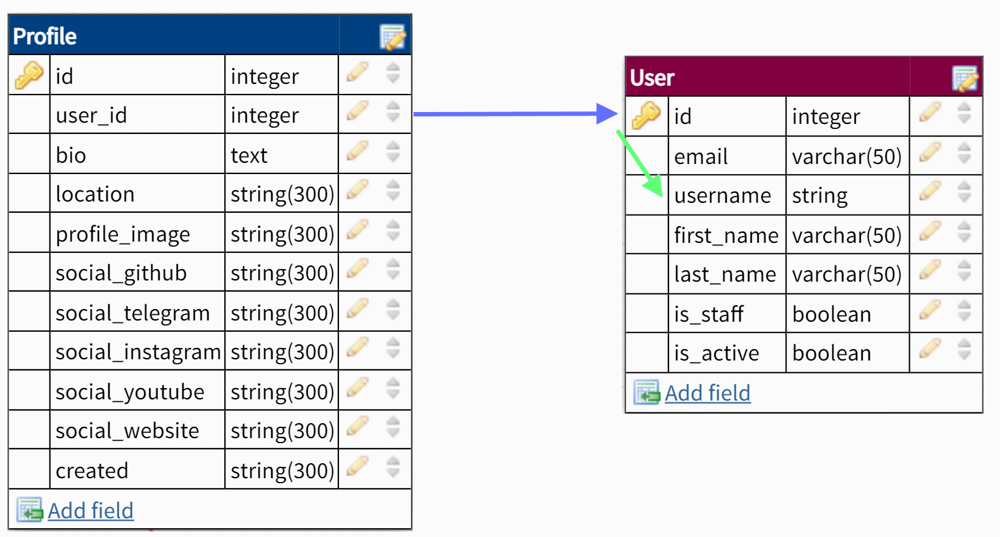
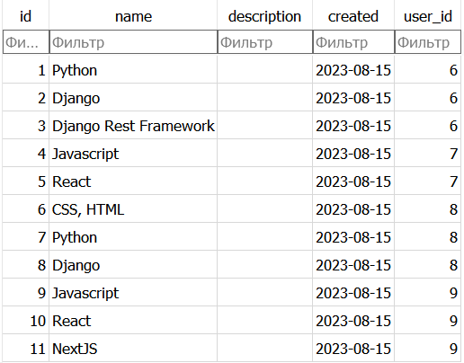
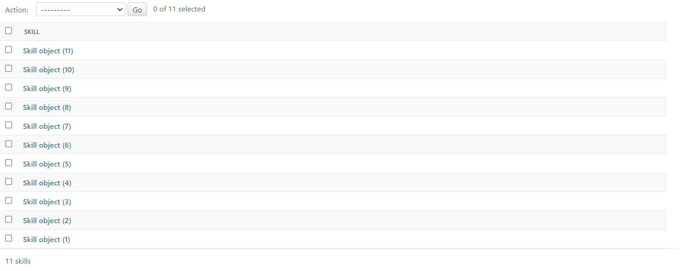
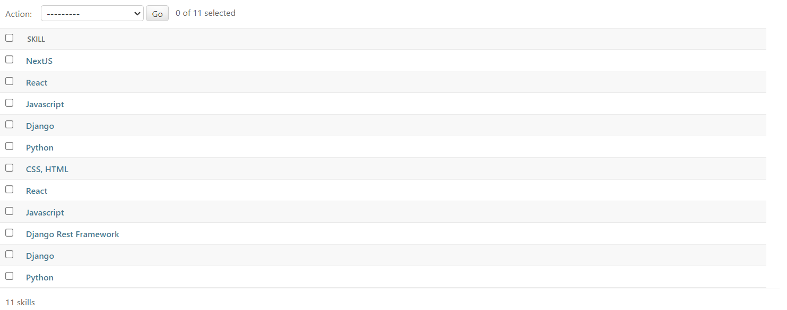
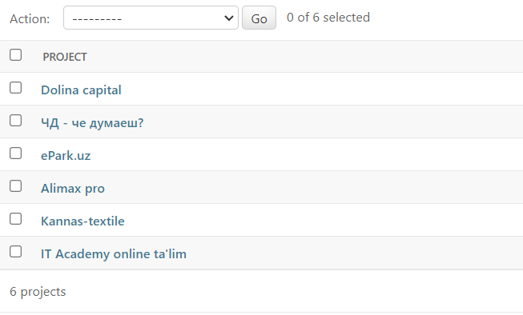
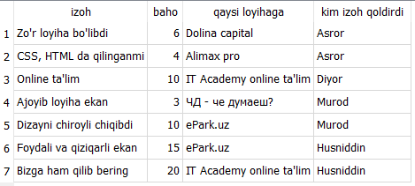

# Mavzu 3: QuerySet. Filtr va shartlar bilan ishlash
 
<!-- TOC -->
* [1. INSERT - kiritish](#1-insert---kiritish)
  * [1.1 User](#11-user)
  * [1.2 Profile](#12-profile)
  * [1.3 Message](#13-message)
  * [1.4 Skill - foydalanuvchi malakasi](#14-skill---foydalanuvchi-malakasi)
  * [1.5 Project](#15-project)
  * [1.6 Review](#16-review)
  * [1.7 Tag](#17-tag)
* [2 SELECT](#2-select)
  * [2.1 all](#21-all)
  * [2.2 get](#22-get)
  * [2.3 filter](#23-filter)
    * [2.3.1 exact](#231-exact)
    * [2.3.2 iexact](#232-iexact)
    * [2.3.3 contains](#233-contains)
    * [2.3.4 icontains](#234-icontains)
    * [2.3.5 in](#235-in)
    * [2.3.6 gt](#236-gt)
    * [2.3.6 gte](#236-gte)
    * [2.3.6 lt](#236-lt)
    * [2.3.6 lte](#236-lte)
    * [2.3.10 startswith](#2310-startswith)
    * [2.3.11 istartswith](#2311-istartswith)
    * [2.3.12 endswith](#2312-endswith)
    * [2.3.13 iendswith](#2313-iendswith)
    * [2.3.14 range](#2314-range)
    * [2.3.15 date](#2315-date)
    * [2.3.16 year](#2316-year)
    * [2.3.17 iso_year](#2317-iso_year)
    * [2.3.18 month](#2318-month)
    * [2.3.19 day](#2319-day)
    * [2.3.20 week](#2320-week)
    * [2.3.21 week_day](#2321-week_day)
    * [2.3.22 iso_week_day](#2322-iso_week_day)
    * [2.3.23 quarter](#2323-quarter)
    * [2.3.24 time](#2324-time)
    * [2.3.25 hour](#2325-hour)
    * [2.3.26 second](#2326-second)
<!-- TOC -->


# 1. INSERT - kiritish
Ma'lumot kiritishning bir necha usulini ko'ramiz:

- Model metodlari yordamida
- Admin panel yordamida
- DB Browser yordamida

<br>

## 1.1 User 
Avval Django konsolini ochib olamiz:
```commandline
python manage.py shell
```

1. User modeliga ma'lumot qo'shamiz
```text
>>> from django.contrib.auth.models import User
>>> asror = User.objects.create(username="Asror", first_name="Asror", last_name="Abduvosiqov",password="12!@qwQW")
>>> murod = User.objects.create(username="Murod", first_name="Murod", last_name="Kusherbayev",password="12!@qwQW")
>>> husniddin = User.objects.create(username="Husniddin", first_name="Husniddin", last_name="Muminov",password="12!@qwQW")
>>> User.objects.create(username="Diyor", first_name="Diyor", last_name="Malikov",password="12!@qwQW")
<User: Diyor>
>>> User.objects.create(username="Jasur", first_name="Jasur",password="12!@qwQW")
<User: Jasur>
>>> User.objects.create(first_name="Otabek")
>>> User.objects.create(first_name="Otabek")
django.db.utils.IntegrityError: UNIQUE constraint failed: auth_user.username
```
Ohirgi holatda xatolik beradi, chunki username ikkita foydaluvchida bir hil bo'lib qoladi, username UNIQUE (qaytarilmas) bo'lishi kerak


Bizda loyihada quyidagi signal bor:
```python
@receiver(post_save, sender=User)
def create_profile(sender, instance, created, **kwargs):
    user = instance
    if created:
        Profile.objects.create(
            user=user
        )
```
Shuni hisobiga har gal user jadvaliga boydalanuvchi qo'shilganida profil jadvaliga unga mos yozuv kiritiladi 
Endi profildagi ma'lumotlarni to'ldirib qo'yish kerak, uning uchun

1. Avval profil obyektini bazadan o'qib olamiz. M: ```asror = Profile.objects.get(user__username='Asror')```
2. So'ng unga o'zgartirish kiritamiz. M: ```asror.location="Toshkent sh. Yunusobod t." ```
3. Keyin saqlaymiz. M: ```asror.save()```


profile jadvali faqat user_id mavjud, chunki signal yordamida profile kiritilgan edi:


## 1.2 Profile

Havolada [Rasmlar](Rasmlar/images) foydalanuvchi rasmlari berilgan

2. Profile modeliga ma'lumot kiritamiz

profil jadvalidan user_name orqali qidirib, bittasini olish 

```text
>>> from users.models import Profile
>>> asror = Profile.objects.get(user__username='Asror')
```
profil atributlarini o'zgartirish

```text
>>> asror
<Profile: Profile object (6)>
>>> asror.location="Toshkent sh. Yunusobod t."
>>> asror.profile_image="portfolio/Asror.png"
>>> asror.social_github="https://github.com/"
>>> asror.social_website="https://www.gazeta.uz/uz/"
```

profil atribut/xususiyatlarini ko'rish

```text
>>> asror
<Profile: Profile object (6)>
>>> asror.location
'Toshkent sh. Yunusobod t.'
```

profil ma'lumotlarini saqlash 

```text
>>> asror.save()
```

Natija profil jadvalida nima o'zgarish bo'ladi?


**Profile.objects.get(user__username='Asror')**

profil jadvalidan bitta profil ni olish uchun shart berish kerak. Bu yerda shart murakkabroq, ya'ni ```user__username='Asror'```

Bu yerda **user__username** nimani bildiradi?

- user - bu User obyekti (jadvalda bir qator ma'lumotga to'g'ri keladi)
- username - user obyektining atributi/hususiyati (jadvalda u ustunga to'g'ri keladi)
__ - bu belgi boshqa obyekt hususiyatini o'qish uchun ishlatiladi

Modelda ko'rinishi 


Jadvalda ko'rinishi 



Endi Murod foydalanuvchisi profilini to'ldiramiz.
Uni ikki qadam bilan olamiz.

Avval user jadvalidan hamm foydalanuvchilarni ko'rishni ko'raylik:

```text
>>> from django.contrib.auth.models import User
>>> User.objects.all()  
<QuerySet [<User: admin>, <User: Asror>, <User: Murod>, <User: Husniddin>, <User: Diyor>, <User: Jasur>, <User: >]>
```

Endi user jadvalidagi foydalanuvchilarning ba'zi ma'lumotlarini ko'ramiz:

```text
>>> for user in  User.objects.all(): print(f'first_name: {user.first_name} \nlast_name: {user.last_name}\nusername:{user.username}\n')
...
first_name:
last_name:
username:admin

first_name: Asror
last_name: Abduvosiqov
username:Asror

first_name: Murod
last_name: Kusherbayev
username:Murod

first_name: Husniddin
last_name: Muminov
username:Husniddin

first_name: Diyor
last_name: Malikov
username:Diyor

first_name: Jasur
last_name:
username:Jasur

first_name: Otabek
last_name:
username:
```

profil jadvalidan Murodni topish uchun ikki qadan bilan topsa ham bo'ladi:

1. Avval user jadvalidan Murod obyektini topamiz
2. Keyin u orqali profil jadvalidan profilni topamiz 

```text
>>> User.objects.get(username = 'Murod')
<User: Murod>
>>> murod = User.objects.get(username = 'Murod')
>>> Profile.objects.get(user=murod)
<Profile: Profile object (7)>
>>> murod_profil = Profile.objects.get(user=murod)
```

Murod profilini o'zgartirib saqlaymiz:

```text
>>> murod_profil.bio="lorem ipsum"
>>> murod_profil.location="Toshkent sh. Sergeli t."
>>> murod_profil.profile_image="portfolio/Murod.png"
>>> murod_profil.save()
```

Natija:


**Vazifa 1:**
Qolgan foydalanuvchilarni ma'lumotlarini to'ldirib qo'ying:

1. Diyor: bio="lorem ipsum", location="Toshkent sh. Mirzo Ulu'bek", profile_image="portfolio/Diyor.png"
2. Husniddin: bio="lorem ipsum", location="Toshkent v. Zagiota tumani", profile_image="portfolio/default_profile.webp", social_github="https://17husniddin.github.io/Potfolio/index.html", social_instagram="https://www.instagram.com/husnidd1n_17/"


## 1.3 Message
Endi message jadvaliga ma'lumot kiritamiz.
Bu qachonki, sahifadan foydalanuvchilar bir-biriga habar jo'natish uchun "Yuborish" tugmasini bosganda serverda quyidagi kodlar orqali amalga oshiriladi:
Habar kiritishda _yuboruvchi_ va _qabul qiluvchi_ haqida ham ma'lumot bo'lishi kerak
Faraz qiling Jasur Husniddinga habar yozganda, u habarni bazaga kiritish uchun quyidagicha yozamiz   

```text
>>> from projects.models import Message
>>> jasur_f = Profile.objects.get(user__username='Jasur')
>>> husniddin_f = Profile.objects.get(user__username='Husniddin')
>>> Message.objects.create(subject='Ish masalasida', body="Siz bilan gaplashsak bo'ladimi? Ishga taklif qilmoqchi edim", sender=jasur_f, receiver=husniddin_f)
```

**Vazifa 2**
<br>
Murod Asrorga quyidagi habarni jo'natsin:
- subject='Ish masalasida' 
- body="Siz bilan qanday bog'lansak bo'ladi"

Natija:

DB Browser da ko'rinishi


Django Admin Panelda ko'rinishi


Sarlavha bilan chiqib turishini xohlasak. Modelning __str__ metodini qayta yozamiz

projects/models.py
```text
# Talabaga yuborilgan habarlar
class Message(models.Model):
    # Habar sarlavhasi
    subject = models.CharField(max_length=100)
    # Habar matni
    body = models.TextField()
    # Habar yozilgan sana
    created = models.DateField(auto_now_add=True)
    sender = models.ForeignKey(Profile, on_delete=models.SET_NULL, null=True, related_name="sender_message")
    receiver = models.ForeignKey(Profile, on_delete=models.SET_NULL, null=True, related_name="receiver_message")


    def __str__(self) -> str: # yangi qo'shilgan qator
        return f'{self.body}' # yangi qo'shilgan qator
```

Endi Django Admin Panelda tushunarli bo'lib ko'rinadi


## 1.4 Skill - foydalanuvchi malakasi


**Vazifa 3**

Foydalanuvchilarga quyidagi malakalarni kiriting.
- Asror:
  1. Python
  2. Django 
  3. Django Rest framework 
- Murod
  1. Javascript
  2. React
- Husniddin
  1. CSS,HTML
  2. Python
  3. Django 
- Diyor
  1. Javascript
  2. React
  3. NextJs

Natija:

DB Browserda ko'rinishi:



Django Admin Panelda ko'rinishi


Keling malaka nomi ko'rinib turadigan qilamiz:

```text
# Talaba malakalari. Bilgan freymvork va dasturlash tillari haqida
class Skill(models.Model):
    # Malaka nomi. M: Javascript
    name = models.CharField(max_length=100)
    # Malaka haqida qisqacha ma'lumot
    description = models.TextField()
    # Kiritilgan sana
    created = models.DateField(auto_now_add=True)
    user = models.ForeignKey(Profile, on_delete=models.SET_NULL, null=True)


    def __str__(self) -> str: # yangi kiritildan qator
        return self.name      # yangi kiritildan qator
```

Natija:


## 1.5 Project

**Vazifa 4**
Havolada [Rasmlar](Rasmlar/images) loyiha rasmlari berilgan
<br>
So'ng bitiruvchilarga quyidagi loyihalarni va loyiha rasmi yo'li bilan nomini kiriting.
- Asror
  - title="IT Academy online ta'lim"
  - image="projects/project-1.png"
  - vote_count=100
  - vote_ratio=60
  - description="lorem ipsum"
  
- Murod
  - title="Kannas-textile"
  - image="projects/project-5.png"
  - vote_count=50
  - vote_ratio=90
  - description="lorem ipsum"

- Husniddin
  - title="Alimax pro"
  - image="projects/project-6.png"
  - vote_count=300
  - vote_ratio=90
  - description="lorem ipsum"

- Diyor
  - title="ePark.uz"
  - image="projects/project-2.png"
  - vote_count=150
  - vote_ratio=20
  - description="lorem ipsum"

  - title="ЧД - че думаеш?"
  - image="projects/project-3.png"
  - vote_count=200
  - vote_ratio=10
  - description="lorem ipsum"

  - title="Dolina capital"
  - image="projects/project-4.png"
  - vote_count=30
  - vote_ratio=70
  - description="lorem ipsum"


Natija:
DB Browserda ko'rinishi:


**Vazifa 5:**
Django Admin Panelda tushunarsiz ro'yxat chiqadi. Sizning vazifa loyiha nomi chiqadigan qiling:

Natija:



## 1.6 Review
**Vazifa 6**
Quyidagi ma'lumotlarni Review jadvaliga kiriting:



**Vazifa 7**
__str__ metodiga o'zgartirish kiriting. Natija quyidagicha bo'lsin:


## 1.7 Tag
Endi ko'pga ko'p bog'lanishda ma'lumot kiritishni ko'rib o'tamiz
Avval taglarni kiritib olamiz
```text
>>> from projects.models import Tag
>>> py=Tag.objects.create(name='Python')
>>> re=Tag.objects.create(name='React')
>>> dj=Tag.objects.create(name='Django')
>>> drf=Tag.objects.create(name='Django Rest Framework')
>>> js=Tag.objects.create(name='Javascript')
>>> css=Tag.objects.create(name='CSS,HTML')
```
Endi esa teglarni loyiha obyektining tag hususiyatiga qo'shamiz. Avval loyihani id orqali qo'lga kiritamiz

```text
>>> from projects.models import Project
>>> for p in Project.objects.all():
...    print(f"{p.id} {p.title} {p.user}")
...
1 IT Academy online ta'lim Asror
2 ePark.uz Diyor
3 ЧД - че думаеш? Diyor
4 Dolina capital Diyor
5 Kannas-textile Murod
6 Alimax pro Husniddin 
```
Deylik "IT Academy online ta'lim" dasturi teglariga "Python" va "Django Rest Framework" ni yozmoqchimiz. Unda avval id=1 bo'lgan loyihani get() metodi bilan olishimiz kerak. Keyin teglarni add() metodi bilan qo'shamiz

```text
>>> pr1 = Project.objects.get(id=1)
>>> pr1.tag.add(py, drf) 
```
id=1 loyihaning teglarini ko'rmoqchi bo'lsak
```text
>>> pr1.tag.all()
<QuerySet [<Tag: Python>, <Tag: Django Rest Framework>]>
```

**Vazifa**
Huddi shunday qolgan loyihalarga quyidagi teglarni kiritib, so'ng tekshiring

- 2 ePark.uz:  React, Javascript
- 3 ЧД - че думаеш?: Python, Django, React, Javascript
- 4 Dolina capital: Javascript, "CSS,HTML"
- 5 Kannas-textile: React, Javascript, "CSS,HTML"
- 6 Alimax pro: Javascript, "CSS,HTML" 


**Vazifa**
Quyidagini vazifalarni Admin panel yordamida bajaring:

1. Project jadvalidagi teg ustuniga (project.tag) _python va javascript_ teglarini qo'shing.
2. project.tag ustunidagi _python va javascript_ ni _Django va React_ ga o'zgartiring
3. Django va React tegini Tag jadvalidan o'chiring
4. DB Browserdan siz qo'shgan yozuvni ochib ko'rsating   


# 2 SELECT
  
## 2.1 all
all() metodi hamma obyektni olish uchun ishlatiladi.
<br>
Masalan hamma teglarni ekranga chiqarish uchun all() metodidan foydalanamiz
```text
from projects.models import Tag
for tag in Tag.objects.all():
  print(f"{tag.id} {tag.name}")
  
5 Python
6 React
7 Django
8 Django Rest Framework
9 Javascript
10 CSS,HTML
```

**Vazifa**
Hamma loyiha, profil, malaka, izoh, habarlarni ekranga chiqaring

## 2.2 get
Bitta obyektni qo'lga kiritish uchun get() metodi ishlatiladi. Parametrga shartini yozamiz. Shartlar murakkab bo'lishi mumkin, hozircha soddasini ko'rib turamiz

id=1 bo'lgan loyihani chiqarish
```text
>>> from projects.models import Project  
>>> Project.objects.get(id=1) 
<Project: IT Academy online ta'lim>
```

id=1 bo'lgan loyiha nechta ovoz to'plagan

```text
>>> from projects.models import Project  
>>> pr=Project.objects.get(id=1) 
>>> pr.vote_count
100
```
Demak id=1 bo'lgan loyiha 100 ovoz to'plagan ekan

Nomi 'ePark.uz' bo'lgan loyiha qaysi dasturlash tillarida va freymworklarda ishlatilgan?

```text
>>> from projects.models import Project  
>>> pr=Project.objects.get(title='ePark.uz')
>>> pr.tag.all()
<QuerySet [<Tag: React>, <Tag: Javascript>]>
```

**Vazifa**
1. Nomi 'ePark.uz' bo'lgan loyihani qaysi dasturchi qilgan
2. id=2 bo'lgan loyiha qancha ovoz to'plagan
3. 'Alimax pro' nomli loyiha demo linkini chiqaring 


## 2.3 filter
Agar natija bir nechta bo'lsa, unda filter metodini qo'llaymiz.

100 ta ovoz olgan loyihalar ro'yxatini chiqaring
```text
>>> for pr in Project.objects.filter(vote_count=100):
...    print(pr.title)
...
IT Academy online ta'lim
```

### 2.3.1 exact
exact sharti aynan berilgan qiymatga tengligini tekshiradi
<br>
Aynan Asrorni malakalarini chiqaring
```text
>>> Skill.objects.filter(user__exact=asror)
<QuerySet [<Skill: Python>, <Skill: Django>, <Skill: Django Rest Framework>]>
```

Web sahifasi bo'lmagan dasturchilar ro'yxatini chiqaring:
```text
>>> [pr.user.username for pr in Profile.objects.filter(social_website__exact=None)]
['Murod', 'Husniddin', 'Diyor', 'Akbar', 'Bekzod', 'Sherzod', 'Eshmat', 'Toshmat', 'Jasur']
```

**Vazifa**
1. Video yuklamagan foydalanuvchilar ro'yxati
2. Profil id=15 bo'lgan foydalanuvcilar ro'yxati

### 2.3.2 iexact
Qiymatni solishtirganda harflar kichik yoki kattaligiga ahamiyat bermaydi
<br>
Nomi 'asror' bo'lgan foydalanuvchini chiqarish kerak

```text
>>> [pr.username for pr in User.objects.filter(first_name='asror')]
[]
>>> [pr.username for pr in User.objects.filter(first_name__exact='asror')]
[]
>>> [pr.username for pr in User.objects.filter(first_name__iexact='asror')]
['Asror']
```

**Vazifa**
1. Nomi 'alimax pro' bo'lgan loyihani get() metodi bilan chiqaring


### 2.3.3 contains
contains tarkibida bor yo'qligini tekshiradi
<br>
Ismida z harfi bor bo'lgan dasturchilar ro'yxatini chiqaring
Avval hammasini ko'rib olamiz:
```text
>>> [user.username for user in User.objects.all()]
['admin', 'Asror', 'Murod', 'Husniddin', 'Diyor', 'Jasur', '', 'Akbar', 'Bekzod', 'Sherzod', 'Eshmat', 'Toshmat']
```
Endi shart bilan chiqaramiz
```text
>>> [user.username for user in User.objects.filter(username__contains='z')]
['Bekzod', 'Sherzod']
```

**Vazifa**
1. Nomida '.' belgisi bor loyihalar ro'yxatini chiqaring
2. Nomida 'IT' yozuvi bor loyihalar ro'yxatini chiqaring

### 2.3.4 icontains
icontains tarkibida bor yo'qligini tekshiradi, contain() metodidan farqi harf katta yoki kichikligini ahamiyati yo'q
SQLite da contains va icontains bir hil ishlaydi

### 2.3.5 in
in sharti berilgan ro'yxatdan kamida bittasi mavjud ekanligini tekshiradi
<br>Python yoki Go ishlatilgan loyihalar ro'yxatini chiqaring

```text
>>> print("\n".join([pr.title for pr in Project.objects.filter(tag__name__in=['Python', 'Go'])]))
IT Academy online ta'lim
ЧД - че думаеш?
```

Asror bilan Husniddin qilgan loyihalarni chiqaring
```text
>>> print("\n".join([pr.title for pr in Project.objects.filter(user__in=[asror, husniddin])]))
IT Academy online ta'lim
Alimax pro
```

**Vazifa**
1. Ovozlar soni 100 yoki 200 yokii 300 ga teng bo'lgan loyiha nomlarini chiqaring
2. Asror yoki Husniddin loyihalarga bergan fikrlarini, qaysi loyihaga fikr berganlari ro'yxatini chiqaring

### 2.3.6 gt
### 2.3.6 gte
### 2.3.6 lt
### 2.3.6 lte

gt,gte,lt,lte solishtirish uchun ishlatiladi. Ma'nolari:
- gt - katta
- gte - katta yoki teng 
- lt - kichik
- lte - kichik yoki teng

Ovozlar soni 100 dan katta bo'lgan loyihalarni, uni qilgan dasturchini  chiqaring

```text
>>> [(pr.id, pr.user, pr.title) for pr in Project.objects.filter(vote_count__gt=100)]
[(2, <Profile: Diyor>, 'ePark.uz'), (3, <Profile: Diyor>, 'ЧД - че думаеш?'), (6, <Profile: Husniddin>, 'Alimax pro')]
```

Tizimga 06.07.2022 sanada kirgan yoki undan avval qo'shilgan dasturchilarni chiqaring
```text
[(pr.created, pr.user) for pr in Profile.objects.filter(created__lte=date(day=6,month=7,year=2022))]
[(datetime.date(2022, 7, 6), <User: Asror>), (datetime.date(2022, 7, 6), <User: Murod>)]
```

**Vazifa**
1. Ovozlar nisbati 50 dan katta bo'lgan loyihalarni nomini va uni qilgan dasturchi ismini chiqaring
2. 01.01.2022 dan 08.08.202 oraliqda ro'yxatdan o'tgan dasturchilarni chiqaring
<br>Yoram uchun [quyidagi](https://docs.djangoproject.com/en/4.0/ref/models/querysets/#operators-that-return-new-querysets) linkka kiring
   

### 2.3.10 startswith
### 2.3.11 istartswith
### 2.3.12 endswith
### 2.3.13 iendswith

- endswith - berilgan qiymat bilan tugashini tekshiradi
- iendswith - endswith bilan o'xashash, faqat harf katta kichikligini ahamiyati bo'lmaydi
- startswith - berilgan qiymat bilan boshlanishini tekshiradi
- istartswith - berilgan startswith bilan o'xashash, faqat harf katta kichikligini ahamiyati bo'lmaydi


Ismi zod bilan tugaydigan foydalanuvchilarni chiqaring
```text
>>> User.objects.filter(username__endswith='zod')
<QuerySet [<User: Bekzod>, <User: Sherzod>]>
```

Ismi a dan  boshlanadigan foydalanuvchilarni chiqaring
```text
>>> User.objects.filter(username__startswith='a')
<QuerySet [<User: admin>, <User: Asror>, <User: Akbar>]>
```

SQLite da startwith bilan istartswith bir hil ishlaydi

**Vazifa**
1. Nomi ka bilan boshlanadigan loyihalarni chiqaring
2. Nomi .uz bilan tugaydigan  loyihalarni chiqaring
3. Rasmi .png bilan tugaydigan foydalanuvchilarni chiqaring 

### 2.3.14 range
range ikki qiymat orasida yotishini tekshiradi

01.01.2022 dan 08.08.202 oraliqda ro'yxatdan o'tgan dasturchilarni chiqaring

```text
>>> [(pr.created, pr.user) for pr in Profile.objects.filter(created__range=(date(day=6,month=7,year=2022),date(day=6,mon
th=7,year=2022)))]
[(datetime.date(2022, 7, 6), <User: Asror>), (datetime.date(2022, 7, 6), <User: Murod>)]
```

**Vazifa**
1. Ovozlar soni 100 bilan 500 oraliqda bo'lgan loyihalarni chiqaring

### 2.3.15 date
### 2.3.16 year
### 2.3.17 iso_year
### 2.3.18 month
### 2.3.19 day
### 2.3.20 week
### 2.3.21 week_day
### 2.3.22 iso_week_day
### 2.3.23 quarter
Yuqoridagi shartlar sana bilan ishlaydi:

- date solishtirish uchun sanani olib beradi
- year solishtirish uchun yilni olib beradi
- month solishtirish uchun oyni olib beradi
- day solishtirish uchun kunni olib beradi
- week solishtirish uchun yildagi hafta tartibini (1-52/53) olib beradi
- week_day solishtirish uchun hafta kunini (1-yakshanba, 7-dushanba) olib beradi
- iso_week_day solishtirish uchun hafta kunini (1-dushanba,7-yakshanba) olib beradi
- quarter  solishtirish uchun fasl tartibini olib beradi (1-4)


**Vazifa**

1. 2022 yilda ro'yxatdan o'tgan foydalanuvchilarni chiqaring
2. aprel oyida ro'yxatdan o'tgan foydalanuvchilarni chiqaring
3. 10 sanada ro'yxatdan o'tgan foydalanuvchilarni chiqaring
4. sanasi 10gacha ro'yxatdan o'tgan foydalanuvchilarni chiqaring

### 2.3.24 time
### 2.3.25 hour
### 2.3.26 second
Yuqoridagi shartlar vaqt bilan ishlaydi.
- time solishtirish uchun vaqtni olib beradi
- hour solishtirish uchun soatni olib beradi
- minute solishtirish uchun daqiqani olib beradi
- second solishtirish uchun soniyani olib beradi

**Vazifa**
1. Bugun yuborilgan habarlarni chiqaring
2. Soat 14 da yuborilgan habarlanri chiqaring
3. Soat 9-12 oraliqda yuborilgan habarlarni chiqaring
4. 12.7.2022 sanada 9-12 oraliqda yuborilgan habarlarni chiqaring


