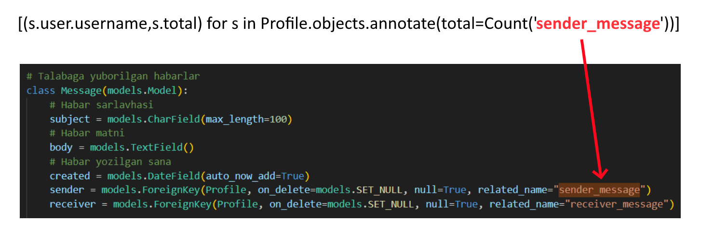
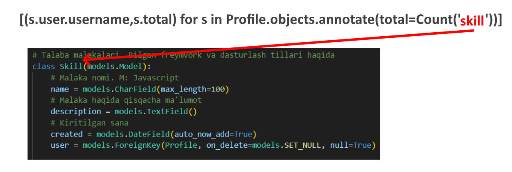

# Mavzu 4: QuerySet qaytaradigan metodlar
 
## Reja:
1. [Bilim](#1-bilim)
   - [1.1 Terminlar](#11-terminlar)
   - [1.2 O'qish uchun materiallar](#12-oqish-uchun-materiallar)
2. [Amaliyot. O'qituvchi](#2-amaliyot-oqituvchi)
3. [Amaliyot. O'quvchi](#3-amaliyot-oquvchi)

## 1. Bilim

### 1.1 Terminlar
```
tuple - o'zgarmas ro'yxat. s'ni boshida bir marta qiymat beriladi, keyin o'zgartirib bo'lmaydi
element - ro'yxat tarkibidagi har bir qiymat
indeks - elementlarning ro'yxatdagi pozitsiyasi
```
## 2. Amaliyot. O'qituvchi

**Reja:**
- [2.1 filter](#21-filter)
- [2.2 exclude](#22-exclude)
- [2.3 annotate](#23-annotate)
- [2.4 alias](#24-alias)
- [2.5 order_by](#25-order_by)
- [2.6 reverse](#26-reverse)
- [2.7 distinct](#27-distinct)
- [2.8 values](#28-values)
- [2.9 values_list](#29-values_list)
- [2.10 dates](#210-dates)
- [2.11 datetime](#211-datetime)
- [2.12 none](#212-none)
- [2.13 all](#213-all)
- [2.14 union](#214-union)
- [2.15 intersection](#215-intersection)
- [2.16 difference](#216-difference)
- [2.17 select_annotaterelated](#217-select_related)

### 2.1 filter
1. Source kodi mavjud bo'lmagan loyihalarni ro'yxatini chiqaring
<br>
   
Agar hamma loyiha source kodi bo'lmasa, u holda, masalan, "IT Academy online ta'lim" loyihasining source kodiga qiymat beramiz. So'ng filterlaymiz
```text
>>> pr = Project.objects.get(title="IT Academy online ta'lim")
>>> pr.source_code="https://github.com/Oybeklinux/portfolio_drf.git"
>>> pr.save()
>>> Project.objects.filter(source_code=None)
<QuerySet [<Project: ePark.uz>, <Project: ЧД - че думаеш?>, <Project: Dolina capital>, <Project: Kannas-textile>, <Proje
ct: Alimax pro>]>
```

### 2.2 exclude
2. Source kodi mavjud bo'lgan loyihalarni ro'yxatini chiqaring
<br>

```text
>>> Project.objects.exclude(source_code=None)
<QuerySet [<Project: IT Academy online ta'lim>]>
```

### 2.3 annotate
Bir qanchasidan bitta qiymat chiqarib beradigan funksiyalar bor. Bular agregat funksiya deyiladi: max, min, count. 

annotate metodi shu funksiyalarni ishlatgan holda natijani olib beradi


3. Har bir profilning nechtadan malakasi bor?

```text
>>> from django.db.models import Count, Max, Min
>>> [(s.user.username,s.total) for s in Profile.objects.annotate(total=Count('skill'))]
[('Asror', 3), ('Murod', 2), ('Husniddin', 3), ('Diyor', 3), ('Jasur', 0), ('Akbar', 0), ('Bekzod', 0), ('Sherzod', 0),
('Eshmat', 0), ('Toshmat', 0)]

```

4. Har bir profilning yuborgan habarlar soni (Avval message jadvalini to'ldirib olamiz)
```text
>>> [(s.user.username,s.total) for s in Profile.objects.annotate(total=Count('sender_message'))]
[('Asror', 3), ('Murod', 2), ('Husniddin', 0), ('Diyor', 0), ('Jasur', 0), ('Akbar', 0), ('Bekzod', 0), ('Sherzod', 0),
('Eshmat', 0), ('Toshmat', 0)]
```

Bu yerda Count('skill') va Count('sender_message') amallari orasidagi **skill** va **sender_message** nomlari qayerdan keldi?







### 2.4 alias
alias() metodi annotate() metodi bilan bir hil, faqat u natijani vaqtinchalik saqlab, usha nom bilan boshqa amallarni bajarish uchun qo'llaniladi. 

5. Har bir profilning yuborgan habarlar sonini agar 2 dan ortiq bo'lsa chiqaring

```text
>>> [s.user.username for s in Profile.objects.alias(total=Count('sender_message')).filter(total__gte=3)]
['Asror']
```

6. 2 dan ortiq habar yuborgan profilni toping. Ulardan faqat berilgan ro'yxatdagi foydalanuvchilarnigina chiqaring

```text
[s.user.username for s in Profile.objects.alias(total=Count('sender_message')).filter(total__gt=1).filter(user__user
name__in=['Murod'])]
['Murod']
```

### 2.5 order_by
order_by QuerySetni tartiblab beradi

7. Hamma profillarni username bo'yicha tartiblab chiqaring

```text
>>> [s for s in Profile.objects.all().order_by('user__username')]
[<Profile: Akbar>, <Profile: Asror>, <Profile: Bekzod>, <Profile: Diyor>, <Profile: Eshmat>, <Profile: Husniddin>, <Prof
ile: Jasur>, <Profile: Murod>, <Profile: Sherzod>, <Profile: Toshmat>]
```
8. Hamma profillarni username bo'yicha teskari tartiblab chiqaring

```text
>>> [s for s in Profile.objects.all().order_by('-user__username')]
[<Profile: Toshmat>, <Profile: Sherzod>, <Profile: Murod>, <Profile: Jasur>, <Profile: Husniddin>, <Profile: Eshmat>, <P
rofile: Diyor>, <Profile: Bekzod>, <Profile: Asror>, <Profile: Akbar>]
```

9. Habarlarni avval yuboruvchi, keyin qabul qiluvchi username bo'yicha tartiblab chiqaring

```text
>>> sender = None
>>> for s in Message.objects.all().order_by('sender__user__username', 'receiver__user__username'):
...    if sender != s.sender:
...       print('=======', s.sender)
...    sender = s.sender
...    print(s.receiver, s.subject)
...
======= Asror
Akbar test ahabar
Diyor test ahabar
Murod test ahabar
======= Murod
Akbar test ahabar
Asror test ahabar

```
### 2.6 reverse
reverse tartiblangan (ya'ni order_by() metodi ishlatilgan) QuerySet teskarilab beradi. Tartiblanmagan QuerySetga qo'llanilsa, ta'siri bo'lmaydi. Tartiblangan QuerySetga ishlatiladi

10. Quyidagi misol id bo'yicha tartiblangan loyihalar ro'yxatini (QuerySet) teskarilab beradi 

```text
>>> [(pr.id,pr.title) for pr in Project.objects.all().order_by('id')]
[(1, "IT Academy online ta'lim"), (2, 'ePark.uz'), (3, 'ЧД - че думаеш?'), (4, 'Dolina capital'), (5, 'Kannas-textile'),
 (6, 'Alimax pro')]
>>> [(pr.id,pr.title) for pr in Project.objects.all().order_by('id').reverse()]
[(6, 'Alimax pro'), (5, 'Kannas-textile'), (4, 'Dolina capital'), (3, 'ЧД - че думаеш?'), (2, 'ePark.uz'), (1, "IT Acade
my online ta'lim")]
```
 
### 2.7 values
values faqat ko'rsatilgan jadval ustunidagi ma'lumotlarnigina olib dict ga o'girib beradi

11. Bazada mavjud bo'lgan hamma dasturchilar malakasi nomini chiqaring

```text
>>> Skill.objects.values('name')
<QuerySet [{'name': 'Python'}, {'name': 'Django'}, {'name': 'Django Rest Framework'}, {'name': 'Javascript'}, {'name': '
React'}, {'name': 'CSS,HTML'}, {'name': 'Python'}, {'name': 'Django'}, {'name': 'Javascript'}, {'name': 'React'}, {'name
': 'NextJs'}]>
```

### 2.7 distinct
distinct QuerySet orasida duplikat qatorlarni chiqarib tashlaydi

12. Bazada qanday malakali dasturchilar bor?

```text
>>> Skill.objects.values('name').distinct()
<QuerySet [{'name': 'Python'}, {'name': 'Django'}, {'name': 'Django Rest Framework'}, {'name': 'Javascript'}, {'name': '
React'}, {'name': 'CSS,HTML'}, {'name': 'NextJs'}]>
```
Yuqoridan ma'lum bo'ladiki, duplikat malakalarni olin tashladi 

13. Tarkibida IT harflari mavjud bo'lgan loyihalarning id va nomini chiqaring

```text
>>> Project.objects.filter(title__icontains='it').values('title', 'id')
<QuerySet [{'title': "IT Academy online ta'lim", 'id': 1}, {'title': 'Dolina capital', 'id': 4}]>
```
E'tibor bering QuerySet Project oyektidan emas, values() metodida ko'rsatildan id va title dan tashkil topgan dict dan iborat

14. Tarkibida IT harflari mavjud bo'lgan loyihalarning nomini kichik harflarda chiqaring

```text
>>> from django.db.models.functions import Lower
>>> Project.objects.filter(title__icontains='it').values('id',title=Lower('title'))
<QuerySet [{'id': 1, 'ltitle': "it academy online ta'lim"}, {'id': 4, 'ltitle': 'dolina capital'}]>
```

### 2.9 values_list
values_list - values() metodi bilan deyarli bir hil faqat farqi shundaki, QuerySet tarkibidagi elementlar values() metodida dict toifasini bo'lsa, values_list() metodida tuple toifasi bo'ladi:
15. Teglarni hammasini ekranga dict va tuple ko'rinishida chiqaring. So'ng ulardan faqat birinchisini chiqaring 
```text
>>> Tag.objects.values()
<QuerySet [{'id': 5, 'name': 'Python', 'created': datetime.date(2022, 7, 8)}, {'id': 6, 'name': 'React', 'created': date
time.date(2022, 7, 8)}, {'id': 7, 'name': 'Django', 'created': datetime.date(2022, 7, 8)}, {'id': 8, 'name': 'Django Res
t Framework', 'created': datetime.date(2022, 7, 8)}, {'id': 9, 'name': 'Javascript', 'created': datetime.date(2022, 7, 8
)}, {'id': 10, 'name': 'CSS,HTML', 'created': datetime.date(2022, 7, 8)}]>
>>> Tag.objects.values_list()
<QuerySet [(5, 'Python', datetime.date(2022, 7, 8)), (6, 'React', datetime.date(2022, 7, 8)), (7, 'Django', datetime.dat
e(2022, 7, 8)), (8, 'Django Rest Framework', datetime.date(2022, 7, 8)), (9, 'Javascript', datetime.date(2022, 7, 8)), (
10, 'CSS,HTML', datetime.date(2022, 7, 8))]>
>>> Tag.objects.values()[0]
{'id': 5, 'name': 'Python', 'created': datetime.date(2022, 7, 8)}
>>> Tag.objects.values_list()[0]
(5, 'Python', datetime.date(2022, 7, 8))
```

16. Teglarni hamma ma'lumoti emas, balki faqat id va nomini tuple ko'rinishida chiqaring

```text
>>> Tag.objects.values_list('id','name')
<QuerySet [(5, 'Python'), (6, 'React'), (7, 'Django'), (8, 'Django Rest Framework'), (9, 'Javascript'), (10, 'CSS,HTML')
]>
```

17. Boshidagi 3ta teglarni faqat id va nomlarini tuple ko'rinishida chiqaring 

```text
>>> Tag.objects.values_list('id','name')[:3]
<QuerySet [(5, 'Python'), (6, 'React'), (7, 'Django')]>
```

### 2.10 dates
dates metodi unikal qiymatlarni qaytaradi. Uning quyidagi parametrlari bor:
- year - ko'rsatilgan maydonning hamma qaytarilmas yillarini ro'yxatini qaytaradi 
- month - ko'rsatilgan maydonning hamma qaytarilmas yil/oylarini ro'yxatini qaytaradi
- week - ko'rsatilgan maydonning hamma qaytarilmas yil/haftalarini ro'yxatini qaytaradi
- day - ko'rsatilgan maydonning hamma qaytarilmas yil/oy/kunlarini ro'yxatini qaytaradi

18. Qaysi yillarda dasturchilar tizimga qo'shilgan?

```text
>>> Profile.objects.dates('created', 'year')
<QuerySet [datetime.date(2022, 1, 1), datetime.date(2021, 1, 1)]>
```
Faqat 2021 va 2022 yilda dasturchilar tizimda ro'yxatdan o'tgan ekan

19. 2022 yilning qaysi oylarida dasturchilar tizimga qo'shilgan

```text
>>> Profile.objects.filter(created__year=2022).dates('created', 'month')
<QuerySet [datetime.date(2022, 6, 1), datetime.date(2022, 7, 1)]>
```
Demak 2022 yilda iyun va iyulda oylarida dasturchilar tizimga qo'shilgan


### 2.12 none
none - bo'sh QuerSet ni qaytaradi , undan keyin boshqa so'rov amalga oshirilmaydi

### 2.13 all
all - jadvaldagi hamma ma'lumotlarni qaytaradi
[Avvalgi darsga qarang](../3.%20QuerySet.%20Shartlar%20bilan%20ishlash)

### 2.14 union
union - ikkita QuerySet ni birlashtiradi. Bu yerda hususiyatlar bir hil bo'lishi kerakligini e'tiborga oling.

20. Habar jo'natganlar va habar yuborganlar ro'yxatini chiqaring. Avval yuboruvchilarni olamiz, so'ng qabul qiluvchilarni, keyin ikkalasini birlashtiramiz

```text
>>> senders = Message.objects.values_list('sender__user__username')
>>> receivers = Message.objects.values_list('receiver__user__username')
>>> senders.union(receivers)
<QuerySet [('Akbar',), ('Asror',), ('Bekzod',), ('Diyor',), ('Eshmat',), ('Husniddin',), ('Jasur',), ('Murod',)]>
```

### 2.15 intersection
union kabi birdan ortiq QuerySet natijalari bilan ishlaydi, lekin u birlashtirmaydi, balki kesishuvchi qiymatlarni ajratib beradi

21. Habar yuborgan va habar qabul qilgan foydalanuvchilarni chiqaring

```text
>>> receivers = Message.objects.values_list('receiver__user__username')
>>> senders = Message.objects.values_list('sender__user__username')
>>> receivers
<QuerySet [('Asror',), ('Murod',), ('Murod',), ('Husniddin',), ('Diyor',), ('Diyor',), ('Diyor',), ('Diyor',), ('Akbar
',), ('Akbar',)]>
>>> senders
<QuerySet [('Asror',), ('Asror',), ('Asror',), ('Murod',), ('Murod',), ('Bekzod',), ('Bekzod',), ('Eshmat',), ('Jasur'
,), ('Jasur',)]>
>>> receivers.intersection(senders)
<QuerySet [('Asror',), ('Murod',)]>
```

### 2.16 difference
difference - intersection kabi birdan ortiq QuerySet natijalari bilan ishlaydi. difference o'z nomi bilan farqini olib beradi. Faqat bunda qaysi QuerySet tarafidan difference chaqirilgan bo'lsa, usha QuerySet da bor, lekin qolganlarida yo'q bo'lganlarini ajratib beradi. E'tibor bering qaysi QuerySet dan chaqirilishiga qarab natijalar har hil bo'ladi.

22. Avval faqat habar jo'natgan lekin qabul qilmagan foydalanuvchilarni, so'ng faqat habar qabul qilgan, ammo habar jo'natmaganlarni chiqaring

```text
>>> receivers = Message.objects.values_list('receiver__user__username')
>>> senders = Message.objects.values_list('sender__user__username')
>>> receivers
<QuerySet [('Asror',), ('Murod',), ('Murod',), ('Husniddin',), ('Diyor',), ('Diyor',), ('Diyor',), ('Diyor',), ('Akbar
',), ('Akbar',)]>
>>> senders
<QuerySet [('Asror',), ('Asror',), ('Asror',), ('Murod',), ('Murod',), ('Bekzod',), ('Bekzod',), ('Eshmat',), ('Jasur'
,), ('Jasur',)]>
>>> senders.difference(receivers)
<QuerySet [('Bekzod',), ('Eshmat',), ('Jasur',)]>
>>> receivers.difference(senders)
<QuerySet [('Akbar',), ('Diyor',), ('Husniddin',)]>
```

### 2.17 select_related
select_related ulangan boshqa jadval ma'lumotlarini birdaniga oladi, keyinchalik ma'lumotlar bazasiga murojaat qilmaslik uchun. Bu boshida ko'proq vaqt olishi mumkin, lekin keyinchalik MBga murojaat bo'lmagani sababli tezlikni oshadi

23. 100 dab ochiq bal olgan loyihalarni toping, so'ng bu loyihani qilgan foydalanuvchilarni username ini chiqaring
<br>

**1-usul** Har so'rovda MBga murojaat bo'ladi

```text
>>> qs = Project.objects.filter(vote_count__gt=100)
>>> qs.values_list('user__social_github')
<QuerySet [(None,), (None,), ('https://17husniddin.github.io/Potfolio/index.html',)]>
```

**2-usul** Keyingi so'rovlarda MBga murojaat bo'lmaydi

```text
>>> qs = Project.objects.select_related('user').filter(vote_count__gt=100)
>>> qs.values_list('user__social_github')
<QuerySet [(None,), (None,), ('https://17husniddin.github.io/Potfolio/index.html',)]>
```
select_related() metodiga Foreign Key bo'lgan atribut nomi beriladi. 

Project modelida bunday atribut faqat bitta: user

Review modlida ikkita: user,project

Message modelida nechta?
### 2.18 prefetch_related

select_related kabi ishlaydi, faqat u ko'pga-ko'p bog'lanishda ishlatiladi

24. Har bir tegda qanday loyihalar yozilgani haqida ma'lumot chiqarish kerak

**1-usul**

```commandline
>>> for tag in Tag.objects.all(): print(tag, tag.project_tag.all())              
...
Tag object (18) <QuerySet [<Project: IT Academy online ta'lim>, <Project: ЧД - че думаеш?>]>
Tag object (19) <QuerySet [<Project: ePark.uz>, <Project: ЧД - че думаеш?>, <Project: Kannas-textile>]>
Tag object (20) <QuerySet [<Project: ЧД - че думаеш?>]>
Tag object (21) <QuerySet [<Project: IT Academy online ta'lim>]>
Tag object (22) <QuerySet [<Project: ePark.uz>, <Project: ЧД - че думаеш?>, <Project: Kannas-textile>, <Project: Alimax pro>]>
Tag object (23) <QuerySet [<Project: Kannas-textile>, <Project: Alimax pro>]>

```

**2-usul**

```commandline
>>> for tag in Tag.objects.prefetch_related('project_tag'): print(tag, tag.project_tag.all())
...
Tag object (18) <QuerySet [<Project: IT Academy online ta'lim>, <Project: ЧД - че думаеш?>]>
Tag object (19) <QuerySet [<Project: ePark.uz>, <Project: ЧД - че думаеш?>, <Project: Kannas-textile>]>
Tag object (20) <QuerySet [<Project: ЧД - че думаеш?>]>
Tag object (21) <QuerySet [<Project: IT Academy online ta'lim>]>
Tag object (22) <QuerySet [<Project: ePark.uz>, <Project: ЧД - че думаеш?>, <Project: Kannas-textile>, <Project: Alimax pro>]>
Tag object (23) <QuerySet [<Project: Kannas-textile>, <Project: Alimax pro>]>
```

Natija bir hil faqat tezligida farq bo'lishi mumkin

## 3. Amaliyot. O'quvchi
3. Har bir profilning nechta loyihasi bor
5. Har bir profilga yuborilgan habarlar soni
6. Har bir profil nechta izoh qoldirgan
7. Har bir loyida nechta teg bor
8. Har bir tegda nechta loyiha yozilgan
9. Loyihalarni nomi bo'yicha tartiblab chiqaring
10. Habarlarni yuborgan foydlanuvchi username bo'yicha tartiblab chiqaring
11. Habarlarni avval yuboruvchi username bo'yicha to'g'ri tartiblab, keyin qabul qiluvchi username bo'yicha teskari tartiblab chiqaring
12. Tarkibida yaxshi, zo'r, chiroyli so'zlaridan biri mavjud bo'lgan habarlarni va yuboruvchi username ini chiqaring
15. Loyihalarni hammasini ekranga dict va tuple ko'rinishida chiqaring
16. Loyihalardan boshidagi ikkitasini ekranga tuple ko'rinishida chiqaring
17. Profillarning hammasini faqat username ini chiqaring va telegramini tuple ko'rinishida chiqarib, username bo'yicha tartibab chiqaring
18. 2022 yil , aprel oyidagi hamma habarlarni chiqaring.
19. 2022 yil , aprelda qaysi kunlari habarlar jo'natilgan (faqat sanalar kerak)
20. Avval barcha malakalarni nomini chiqaring, so'ng barcha teglar nomini. Keyin ikkalasini union bilan birlashtirib chiqaring
21. Skill va Tag jadvallarining ikkalasida uchraydigan qiymatlarni (name) chiqaring
22. Skill jadvalida mavjud, lekin Tag jadvalida mavjud bo'lmagan qiymatlarni (name) chiqaring
23. Avval 5 ta foydalanuvchini chiqaring, so'ng ular yozgan habarlanri, agar bo'lsa. MBga murojaat bir marta bo'lsin
